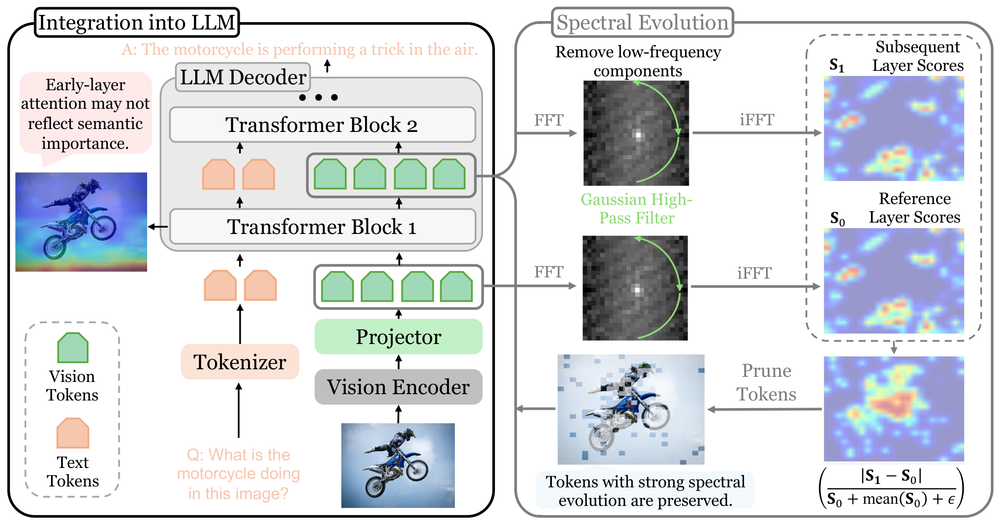

<div align="center">
  <h1>CLSE: Cross-Layer Spectral Evolution for Token Pruning<br>in Multimodal Large Language Models</h1>
  <h3>🔥 Accepted at ECCV 2026</h3>
</div>

<h4 align="center">

[Bin Chen](https://zjubinchen.github.io/)<sup>1,2</sup>,
[Yuxiang Cai](https://yuxiangcai.github.io/)<sup>1,2*</sup>,
[Yadan Luo](https://scholar.google.com/citations?user=0CIcN0cAAAAJ&hl=en)<sup>3</sup>,
[Yi Zhang]()<sup>4</sup>, <br>
[Jianwei Yin]()<sup>1,2</sup>,
[Zhi Chen]()<sup>5✉</sup>

<sup>1</sup> School of Software Technology, Zhejiang University, Ningbo, China &nbsp;
<sup>2</sup> Zhejiang Key Laboratory of Digital-Intelligence Service Technology, China &nbsp;
<sup>3</sup> The University of Queensland, St Lucia, QLD, Australia &nbsp;
<sup>4</sup> Singapore Management University, Singapore &nbsp;
<sup>5</sup> The University of Southern Queensland, Toowoomba, QLD, Australia

<small>* Corresponding Authors: Yuxiang Cai, Zhi Chen</small>

</h4>

<div align="center">

[]()
[]()
[](LICENSE)
[](https://github.com/zjubinchen/CLSE/stargazers)
</div>

## 🔥 News
* **`2026.06.19`** 🎉🎉 CLSE is accepted at **ECCV 2026**! Code and models are now available!


## 👀 Overview
<p align='center'>

</p>

> **TLDR:** We propose CLSE (**C**ross-**L**ayer **S**pectral **E**volution), a training-free token pruning method for MLLMs that quantifies how visual token representations evolve across Transformer layers in the frequency domain. Tokens with stronger spectral redistribution from high-frequency details to low-frequency semantics are preserved. CLSE achieves **up to 88.9% token reduction** while maintaining **94.8%–99.4%** of original performance, and is compatible with both image and video MLLMs.


## 🛠 Installation

### LLaVA-1.5

```bash
git clone https://github.com/zjubinchen/CLSE
cd CLSE/LLaVA1.5

conda create -n clse python=3.10 -y
conda activate clse
pip install -e transformers-4.37.2
pip install -e .
pip install -e ../lmms-eval
pip install -e transformers-4.37.2   # patched transformers last, overrides lmms-eval's
```

### Qwen2-VL

```bash
cd CLSE/Qwen2VL

conda create -n clse_qwen python=3.10 -y
conda activate clse_qwen
pip install -r requirements.txt
pip install -e ../lmms-eval
pip install -e transformers-4.57.6   # patched transformers last, overrides lmms-eval's
```

### Video-LLaVA

```bash
git checkout video                     # switch to video branch
cd CLSE

conda create -n clse_video python=3.10 -y
conda activate clse_video
pip install -e transformers-4.37.2
pip install -e .

```

## 🎯 Usage

### LLaVA-1.5

```bash
cd LLaVA1.5

CUDA_VISIBLE_DEVICES=0 RETAIN_TOKEN=192 PRUNE=True bash scripts/v1_5/eval/gqa.sh
CUDA_VISIBLE_DEVICES=0 RETAIN_TOKEN=192 PRUNE=True bash scripts/v1_5/eval/mmbench.sh
CUDA_VISIBLE_DEVICES=0 RETAIN_TOKEN=192 PRUNE=True bash scripts/v1_5/eval/mme.sh
CUDA_VISIBLE_DEVICES=0 RETAIN_TOKEN=192 PRUNE=True bash scripts/v1_5/eval/pope.sh

RETAIN_TOKEN=192 prune=True bash llava_lmms_eval.sh
```

### Qwen2-VL

```bash
cd Qwen2VL
RETAIN_RATIO=0.334 PRUNE=True bash qwen2vl_lmms_eval.sh
RETAIN_RATIO=0.223 PRUNE=True bash qwen2vl_lmms_eval.sh
RETAIN_RATIO=0.112 PRUNE=True bash qwen2vl_lmms_eval.sh
```

### Video-LLaVA (video branch)

```bash
git checkout video
# Evaluate with CLSE token pruning (video)
CUDA_VISIBLE_DEVICES=0 bash scripts/v1_5/eval/run_qa_activitynet.sh  194
CUDA_VISIBLE_DEVICES=0 bash scripts/v1_5/eval/run_qa_msvd.sh         194
CUDA_VISIBLE_DEVICES=0 bash scripts/v1_5/eval/run_qa_msrvtt.sh       194
CUDA_VISIBLE_DEVICES=0 bash scripts/v1_5/eval/run_qa_tgif.sh         194
```

## 📊 Key Results

### Image Benchmarks (LLaVA-1.5-7B)

| Method | Venue | 192 Tokens (↓66.7%) | 128 Tokens (↓77.8%) | 64 Tokens (↓88.9%) |
|---|---|---|---|---|
| FastV | ECCV'24 | 92.1% | 87.2% | 78.0% |
| PDrop | CVPR'25 | 96.9% | 95.3% | 77.0% |
| SparseVLM | ICML'25 | 96.3% | 93.7% | 84.3% |
| FiCoCo-V | AAAI'26 | 96.2% | 94.3% | 89.8% |
| **CLSE (Ours)** | **ECCV'26** | **99.4%** | **98.1%** | **94.8%** |

*Performance relative to the vanilla model (576 tokens, 100%). Averaged over GQA, MMB, MMB-CN, MME, POPE, SQA, VQAText, VizWiz, and OCRBench.*

### Video Benchmarks (Video-LLaVA-7B)

CLSE and CLSE-M achieve the **highest accuracy** among all training-free methods under **>90% token reduction**, matching or exceeding vanilla model performance when combined with token merging.

### Efficiency Gains

| | Prefill Time ↓ | FLOPs ↓ | KV Cache ↓ | Throughput ↑ |
|---|---|---|---|---|
| LLaVA-1.5 (192 tok) | **2.2× faster** | **3.0× lower** | **3.0× smaller** | **1.7× higher** |
| Video-LLaVA (194 tok) | **10.6× faster** | **10.6× lower** | **10.6× smaller** | **8.3× higher** |

## 📁 Repository Structure

> This repository uses a **branch-based** layout: `main` for image MLLMs (LLaVA, Qwen2-VL) and `video` for Video-LLaVA. Shared modules (`transformers-4.37.2`, `lmms-eval`) are present on both branches.

### `main` branch — Image MLLMs

```
CLSE/
├── LLaVA1.5/                  # CLSE integration for LLaVA-1.5 & LLaVA-Next
│   ├── llava/model/language_model/
│   │   ├── clse_model.py          # CLSELlamaModel with pruning logic
│   │   ├── tools.py               # Spectral scoring utilities (FFT, evolution)
│   │   └── llava_llama.py         # Modified to inherit CLSELlamaModel
│   ├── transformers-4.37.2/       # Patched transformers (shared)
│   └── scripts/v1_5/eval/         # Evaluation scripts
├── Qwen2VL/                   # CLSE integration for Qwen2-VL
│   ├── modeling_qwen2_vl_clse.py  # CLSE-augmented Qwen2-VL model
│   ├── tools.py                   # Spectral scoring utilities
│   ├── transformers-4.57.6/       # Patched transformers
│   └── eval_scripts/              # Evaluation scripts
├── lmms-eval/                 # Evaluation framework (modified for CLSE)
└── images/                    # Overview figures
```

### `video` branch — Video MLLM

```
CLSE/
├── videollava/                # CLSE integration for Video-LLaVA
│   └── model/language_model/
│       ├── clse_model.py          # CLSE model for video
│       └── tools.py               # Video-compatible spectral scoring
├── scripts/                   # Training & evaluation scripts
│   └── v1_5/eval/                 # Video QA & benchmark scripts
├── transformers-4.37.2/       # Shared patched transformers
├── lmms-eval/                 # Evaluation framework
├── pyproject.toml
└── images/                    # Overview figures
```

## 🧪 How CLSE Works

<p align='center'>

</p>

1. **Reference Recording** — At layer ℓ, snapshot visual token features as reference
2. **Spectral Scoring** — At layer ℓ+1, compute per-token high-frequency energy via 2D FFT with Gaussian high-pass filtering
3. **Evolution Intensity** — Measure the normalized cross-layer spectral change: tokens that undergo meaningful structural-to-semantic transitions score higher
4. **Pruning** — Select top-K tokens by evolution intensity and continue decoding with the pruned sequence

Theoretical justification: selecting top-K tokens by CLSE **minimizes an upper bound** on the perturbation of subsequent decoder layers (see paper for proof).

## 🔑 License

This project is released under the [Apache 2.0 license](LICENSE).

## 📌 Citation

If you find CLSE helpful for your research, please consider citing:

```bibtex
@inproceedings{chen2026clse,
  title={Spectral Evolution-Guided Token Pruning in Multimodal Large Language Models},
  author={Chen, Bin and Cai, Yuxiang and Luo, Yadan and Zhang, Yi and Yin, Jianwei and Chen, Zhi},
  booktitle={European Conference on Computer Vision (ECCV)},
  year={2026}
}
```

## 👍 Acknowledgment

We extend our gratitude to the open-source efforts of [LLaVA](https://github.com/haotian-liu/LLaVA), [Qwen2-VL](https://github.com/QwenLM/Qwen2-VL), [Video-LLaVA](https://github.com/PKU-YuanGroup/Video-LLaVA), and [lmms-eval](https://github.com/EvolvingLMMs-Lab/lmms-eval).

## 📩 Contact

For questions about the paper or code, please email `caiyuxiang@zju.edu.cn` or `zhi.chen@unisq.edu.au`, or open an issue on GitHub.
